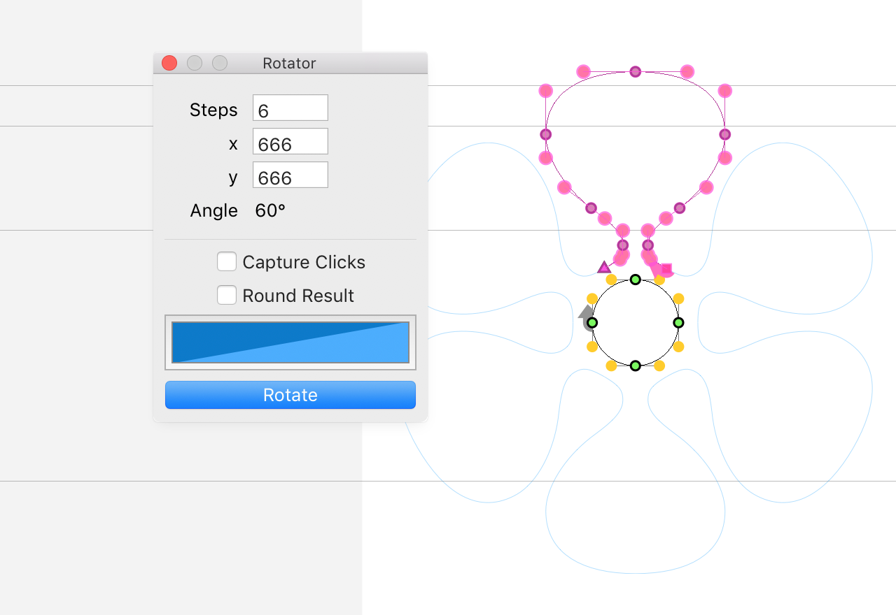

# Rotator
Robofont extension for rotating selected outlines or whole glyphs.  

The rotation center can be set by entering the coordinate values, or by activating “capture clicks” and then clicking anywhere on the canvas.  
A preview of the rotation is shown in the glyph window; and will dynamically update when new values are given, or other outlines are selected. 

## Versions
    0.5 2015-03-01  Make text boxes better with digesting (ignoring) malicious input.
    0.4 2014-07-30  Update UI, get rid of plist files, add preview glyph,
                    add optional rounding for resulting glyph.
    0.3 2013-11-08  Add click capture for setting rotation center.
    0.2 2013-03     Re-write for Robofont.
    0.1 2013-02-28  Update with plist for storing preferences.
    0.0 2012        FL version.

## Background

I originally wrote this when drawing [Zapf Dingbats](http://en.wikipedia.org/wiki/Zapf_Dingbats) for [FF Quixo](https://www.fontfont.com/fonts/quixo):

    ✁✂✃✄✅✆✇✈✉✊✋✌✍✎✏✐✑✒ 
    ✓✔✕✖✗✘✙✚✛✜✝✞✟✠✡✢✣✤✥✦✧✨✩ 
    ✪✫✬✭✮✯✰✱✲✳✴✵✶✷✸✹✺✻✼✽✾✿ 
    ❀❁❂❃❄❅❆❇❈❉❊❋❌❍❎❏❐❑❒❓❔ 
    ❕❖❗❘❙❚❛❜❝❞❟❠❡❢❣❤❥❦❧❨❩❪❫❬❭❮❯❰❱❲❳❴❵     
    ❶❷❸❹❺❻❼❽❾❿➀➁➂➃➄➅➆➇➈➉ 
    ➊➋➌➍➎➏➐➑➒➓➔➕➖➗ 
    ➘➙➚➛➜➝➞➟➠➡➢➣➤➥➦➧➨➩➪➫ 
    ➬➭➮➯➰➱➲➳➴➵➶➷➸➹➺➻➼➽➾ 

This script was very useful for the flowery- and asterisky glyphs.  
No procrastination involved, why are you asking?

## MIT License

Copyright (c) 2015 Frank Grießhammer

Permission is hereby granted, free of charge, to any person obtaining a copy of this software and associated documentation files (the "Software"), to deal in the Software without restriction, including without limitation the rights to use, copy, modify, merge, publish, distribute, sublicense, and/or sell copies of the Software, and to permit persons to whom the Software is furnished to do so, subject to the following conditions:

The above copyright notice and this permission notice shall be included in all copies or substantial portions of the Software.

THE SOFTWARE IS PROVIDED "AS IS", WITHOUT WARRANTY OF ANY KIND, EXPRESS OR IMPLIED, INCLUDING BUT NOT LIMITED TO THE WARRANTIES OF MERCHANTABILITY, FITNESS FOR A PARTICULAR PURPOSE AND NONINFRINGEMENT. IN NO EVENT SHALL THE AUTHORS OR COPYRIGHT HOLDERS BE LIABLE FOR ANY CLAIM, DAMAGES OR OTHER LIABILITY, WHETHER IN AN ACTION OF CONTRACT, TORT OR OTHERWISE, ARISING FROM, OUT OF OR IN CONNECTION WITH THE SOFTWARE OR THE USE OR OTHER DEALINGS IN THE SOFTWARE.
